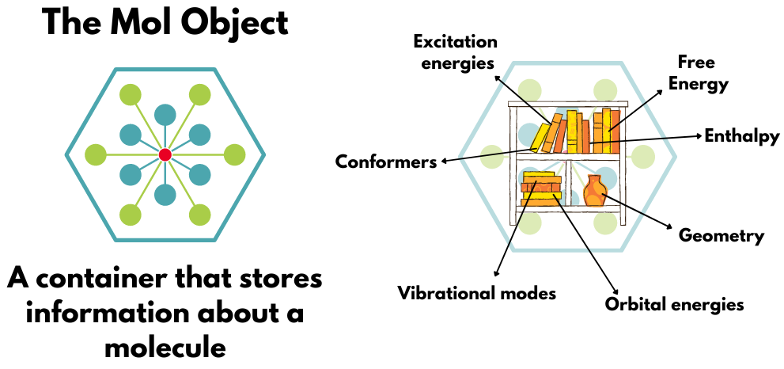
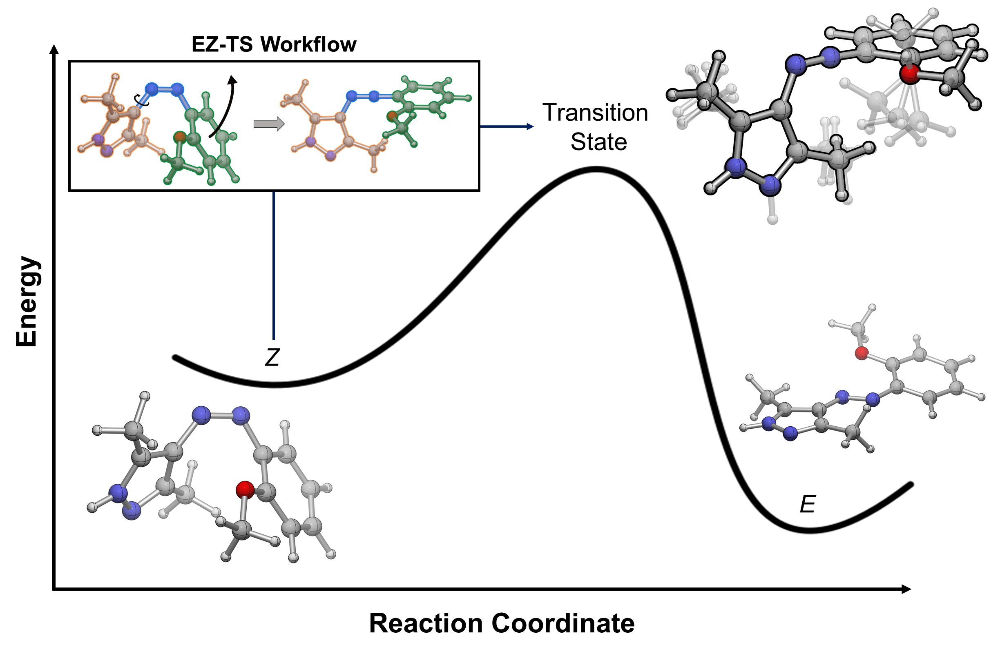

# Cheminformatics and Computational Chemistry tools

## I am a recent graduate from Northeastern and use this GitHub to archive a few projects

My interests are at the intersection of chemistry and data science, leveraging modern compute power to answer interesting and impactful chemical problems. I started learning Python to automate QM calculations I was tired of running by hand a few years ago, and have tried to post a few of the interesting projects I've worked on here along the way!

There's some pretty old and outdated code here that I'm slowly fixing up in my spare time, but the main purpose of this GitHub at the moment is to host the **WorkflowV2** codebase used for building automated QM calculation pipelines by the Lopez Lab!

# WorkflowV2

# EZ-TS

